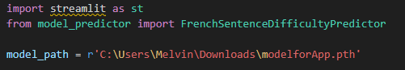
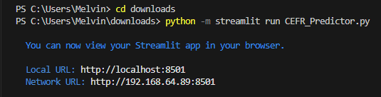

# Data science and Machine Learning - Detecting the difficulty level of French texts 2023 :mechanical_arm:

Groupe: Team Google

## Context of the Project :space_invader:

During our master's courses on data science, we took part in a class project as part of the fundamental Data science and machine learning course. The aim of this project was to create a model capable of predicting the language level of a French text between A1 to C2.

## Data :minidisc:
To do this, we were provided with a set of data containing:
* Training dataset: 
> Contain 4'800 lines of french text labeled.

Contain 3 features: `id`, `sentence`, and `difficulty`
 

* Test dataset:
> Contain 1'200 lines unlabeled.

Contain 2 features: `id` and `sentence`

## Methodology :ledger:
### Basic models :hatching_chick:
We start by trying on some basic model from Sklearn with Enhancing Textual Data with Linguistic Features. These additional features are intended to capture more nuanced aspects of the text, which can be highly beneficial for downstream Natural Language Processing (NLP) tasks, such as difficulty level assessment.

**Here is the list of these features extracted:**
 * Sentence Length
 * Average Word Length
 * Lexical Diversity
 * Syntactic Complexity
 * Part-of-Speech (POS) Counts

By integrating diverse linguistic features, our goal is to enrich the dataset and improve machine learning model performance by enabling more informed decisions through a broader range of inputs.

#### Here the result of our basic model with integretion of linguistic feartures:

| Model               | Precision | Recall  | F1-Score | Accuracy |
|---------------------|-----------|---------|----------|----------|
| Logistic Regression | 0.458717  | 0.467708| 0.457882 | 0.467708 |
| kNN                 | 0.340016  | 0.346875| 0.335963 | 0.346875 |
| Decision Tree       | 0.406695  | 0.408333| 0.400994 | 0.408333 |
| Random Forests      | 0.426190  | 0.435417| 0.423571 | 0.435417 |
| SVM                 | 0.475693  | 0.482292| 0.476856 | 0.482292 |
| XGBoost             | 0.446759  | 0.451042| 0.447470 | 0.451042 |

A more in depth analysis is given for each model and metrics in the colab file `COMPETEKAGGLE_SKLEARN_MODELS.ipynb`

***
### Pre-trained model :eagle:
After this fist step of trying basic model, we opted to experiment with a pretrained model. After exploring Hugging Face's repository of pretrained models, we identified the CamemBERT model, a French adaptation of the BERT model. Employing the CamemBERT model with a sequence classification produce the most favorable outcomes. We also tried the Flaubert model, which did not produce such a good prediction (we didn't try enough hyper-parameters optimization with it). 

The explanations and steps to build our model are all detailed in the Colab file `COMPETEKAGGLETEST_CamemBERT.ipynb`. We tried a lot of parameters and the best results were with this configuration : 
* Model: Camembert-baseCCnet
* Epochs: 3
* Batch size: 16
* Learning rate: 5e-5
* Data split: 80% train, 20% validation
* Random state: 42
* Optimizer: AdamW

The other submissions till the end of the Kaggle never reached our `0.595` score. Even with some data augmentations (you change see how we did that in the file `Dataaugmentation.ipynb`).

***

## Launching the Streamlit App :rocket:

To interact with our model via an engaging Streamlit application, follow these instructions:

### Step 1: Download the Model and Scripts
* Go to the **Releases** section of this GitHub repository.
* Download the model file (around 422 MB) from the latest release.
* Download `CEFR_Predictor.py` and `model_predictor.py` from the repository in the StreamlitApp folder.

### Step 2: Modify the Path in the Code
* In the `CEFR_Predictor.py` script, update the `model_path` variable to the path where you downloaded the model file.

### Step 3: Install Required Libraries
* Make sure you have the following libraries installed: `pip install torch transformers joblib streamlit`

### Step 4: Run the Streamlit App
* Open your terminal or command prompt.
* Navigate to the directory where you downloaded CEFR_Predictor.py and model_predictor.py.
* Run the app with: `python -m streamlit run CEFR_Predictor.py`
* The Streamlit app will start and be available in your web browser. Follow the terminal instructions to view the app.
  

## Enjoy Interacting with Our French Text Difficulty Predictor !
